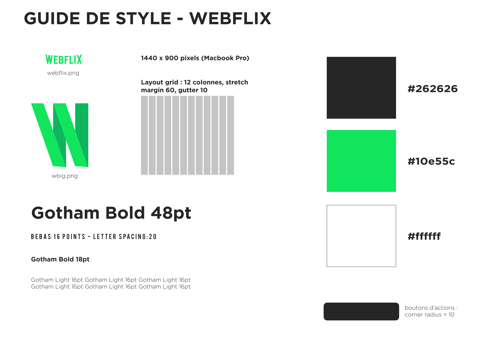
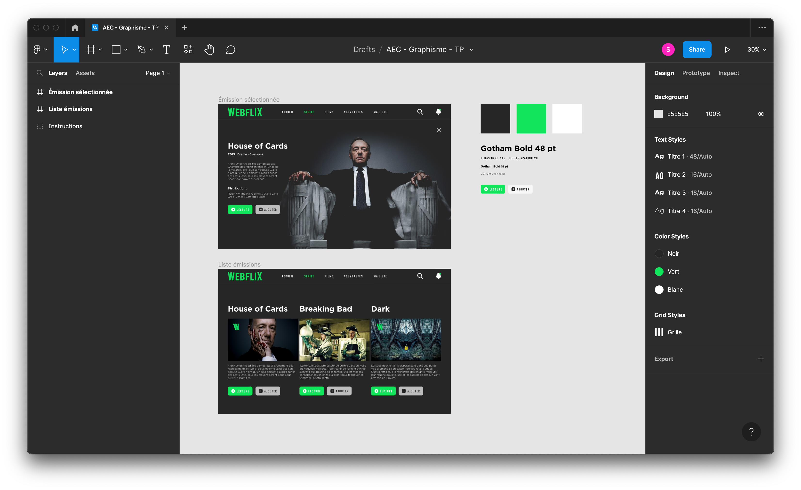

# Description 

Projet réalisé dans le cadre de mon AEC en développement web. 

Il s'agissait de créer une interface de type Netflix, en respectant les consignes suivantes :  

Inclure dans vos interfaces les fichiers logowebflix.png, wbig.png, au minimum 4 photos de votre choix tirées d’internet et au moins un texte pour chacun des styles de texte spécifiés dans le guide de styles. Intégrez ces éléments de manière pertinente et en respectant l’alignement avec la grille de colonnes de vos plans de travail.

## Table des matières

1. [Visuels](#visuels)
2. [Prototype Figma](#prototype-figma)

# Visuels

# Prototype Figma 

[Consulter le prototype Figma du projet](https://www.figma.com/proto/Z3UqLVCg58RcXxPLm9pDZp/AEC---Graphisme---TP?page-id=0%3A1&node-id=3%3A56&viewport=118%2C196%2C0.3&scaling=min-zoom)

 
